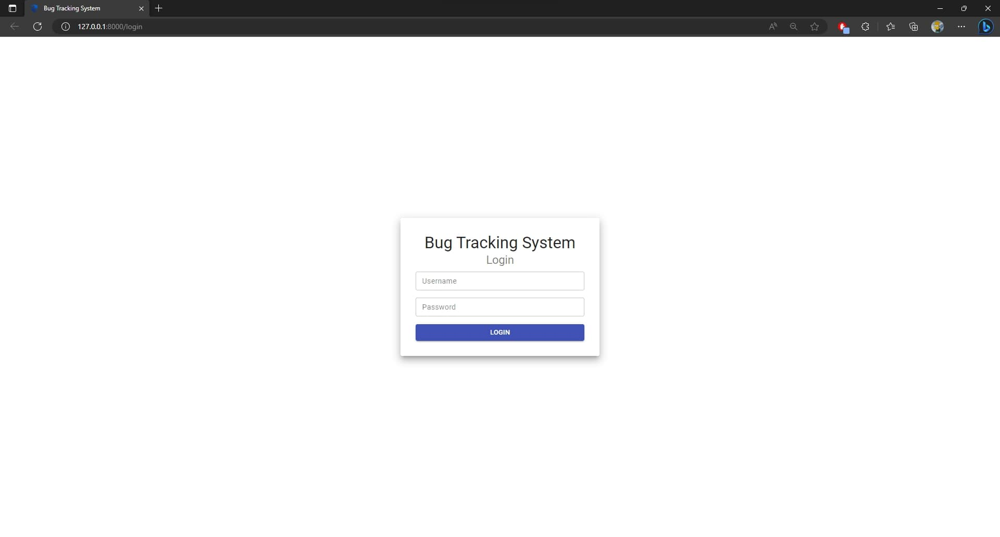
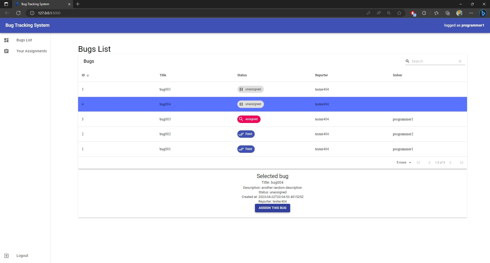
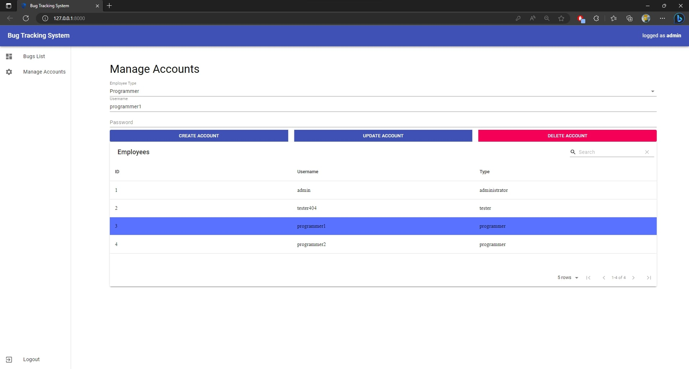
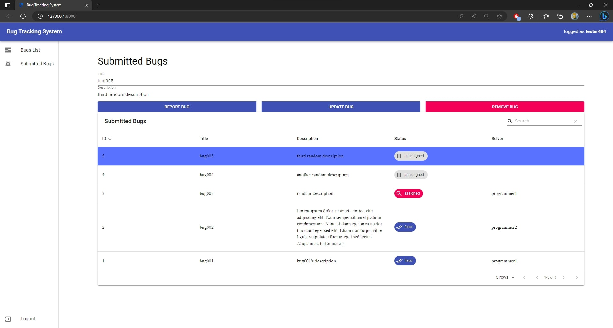
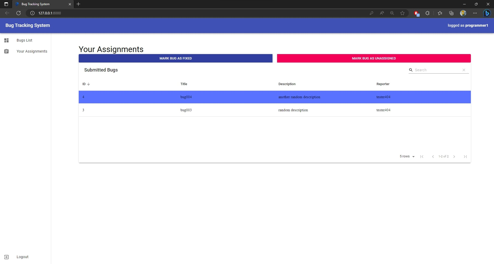

# <strong>Bug Tracking System</strong>

## <em><strong>Requirements</strong></em>

A software company provides its programmers and testers with a system through which they can communicate online. Each employee has at his disposal a terminal through which:
- the administrators can manage the accounts and perform CRUD operations on them, such as creating, updating, and removing an account.
- the testers can report a bug by entering its name and its description, after the bug is registered, all programmers will see the updated list of bugs.
- the programmers can see the list of bugs; also, the programmer can select a bug from the list and trigger a button declaring that he assigned that bug, in which case the bug is marked as assigned for all the programmers, and the tester who registered the bug cannot longer modify it.

## <em><strong>Functional Model</strong></em>

### <strong>Employee</strong>

- <em>login</em>: the employee opens the web application and, if their session key isn’t registered (they haven’t logged in before or they logged out at the last session), the system will show a form with two text fields and a button, where the employee needs to enter their username and password. If the credentials the employee will enter would be incorrect, the system will pop up an error message and the employee can try again, otherwise the system will show the main page of the application. If the employee logged in before with the same session key and they didn’t log out yet, the main page of the application will be shown directly.
- <em>log out</em>: the employee wants to log out, so they press the log out button in the main page. If the log out is successful, the system will log them out, otherwise an error message will pop up.
- <em>view list of bugs</em>: if the employee isn’t at the list of bugs page, they need to press the view bugs button, when the employee is at the list of bugs page the system will show them the list of bugs

### <strong>Administrator</strong>

-	<em>manage accounts</em>: if the administrator isn’t at the accounts management page, they need to press the manage accounts button; once there, the system will show them the list of accounts and the administrator can do three operations:
    - <em>create an account</em>: the administrator selects the type of the account, enters a username and a password, then they press the create account button, if the data they entered is incorrect, the system will pop up an error message, otherwise a confirmation dialog will pop up, if the administrator will choose to not continue, the system will return to its initial state, otherwise, if the creation fails, the system will pop up an error message, otherwise the system will show a success message and the accounts list will refresh.
    - <em>update an account</em>: the administrator selects an employee, selects the new type of the accounts, enters the new username and the new password, then they press the update account button, if the data they entered is incorrect, the system will pop up an error message, otherwise a confirmation dialog will pop up, if the administrator will choose to not continue, the system will return to its initial state, otherwise, if the update fails, the system will pop up an error message, otherwise the system will show a success message and the accounts list will refresh
    - <em>delete an account</em>: the administrator selects an employee, then they press the delete account button, if no account has been selected, an error message will pop up, otherwise a confirmation dialog will pop up, if the administrator will choose to not continue, the system will return to its initial state, otherwise, if the deletion fails, the system will pop up an error message, otherwise the system will show a success message and the accounts list will refresh.

### <strong>Tester</strong>

- <em>manage submitted bugs</em>: if the tester isn’t at the submitted bugs management page, they need to press the manage submitted bugs button; once there, the system will show them the list of their submitted bugs and the tester can do three operations:
    - <em>report a bug</em>: the tester enters the title of the bug and its description, then they press the report bug button, if the data they entered is incorrect, the system will pop up an error message, otherwise a confirmation dialog will pop up, if the tester will choose to not continue, the system will return to its initial state, otherwise, if the creation fails, the system will pop up an error message, otherwise the system will show a success message and the bugs list will refresh
    - <em>update a bug</em>: the tester selects a bug, enters the new title and the new description, then they press the update bug button, if the data they entered is incorrect, the system will pop up an error message, otherwise a confirmation dialog will pop up, if the tester will choose to not continue, the system will return to its initial state, otherwise, if the update fails, the system will pop up an error message, otherwise the system will show a success message and the bugs list will refresh
    - <em>remove a bug</em>: the tester selects a bug, then they press the remove bug button, if no bug has been selected, an error message will pop up, otherwise a confirmation dialog will pop up, if the tester will choose to not continue, the system will return to its initial state, otherwise, if the deletion fails, the system will pop up an error message, otherwise the system will show a success message and the bugs list will refresh.

### <strong>Programmer</strong>

- <em>assign a bug</em>: if the programmer isn’t at the list of bugs page, they need to press the view bugs button; once there the system will show them the list of all bugs, if the programmer selects an unassigned bug, the system will show them an assign bug button, if the programmer presses it and the assignation is failed, the system will show them an error message, otherwise the bug will be assigned and the bugs list will refresh.
- <em>manage assigned bugs</em>: if the programmer isn’t at the assigned bugs management page, they need to press the manage assigned bugs button; once there, the system will show them the list of their assigned bugs and the programmer can do two operations:
    - <em>mark bug as unassigned</em>: the programmer selects an bug, then they press the mark as unassigned button, if no bug has been selected, an error message will pop up, otherwise a confirmation dialog will pop up, if the programmer will choose to not continue, the system will return to its initial state, otherwise, if the status change fails, the system will pop up an error message, otherwise the system will show a success message and the bugs list will refresh.
    - <em>mark bug as fixed</em>: the programmer selects an bug, then they press the mark as fixed button, if no bug has been selected, an error message will pop up, otherwise a confirmation dialog will pop up, if the programmer will choose to not continue, the system will return to its initial state, otherwise, if the status change fails, the system will pop up an error message, otherwise the system will show a success message and the bugs list will refresh.

## <em><strong>Concept Model</strong></em>

#### <em>Model Class Diagram</em>

#### <em>Finished Class Diagram</em>

## <em><strong>Database Diagram</strong></em>

## <em><strong>Dynamic Model</strong></em>

### <strong>Employee Diagrams</strong>

#### <em>Login Sequence Diagram - Normal Flow</em>

#### <em>Logout Sequence Diagram - Normal Flow</em>

#### <em>View Bugs List Sequence Diagram - Normal Flow</em>

### <strong>Administrator Diagrams</strong>

#### <em>Manage Accounts Sequence Diagram - Normal Flow</em>

#### <em>Create Account Sequence Diagram - Normal Flow</em>

#### <em>Update Account Communication Diagram - Normal Flow</em>

#### <em>Delete Account Sequence Diagram - Normal Flow</em>

### <strong>Tester Diagrams</strong>

#### <em>Manage Submitted Bugs Sequence Diagram - Normal Flow</em>

#### <em>Report Bug Sequence Diagram - Normal Flow</em>

#### <em>Update Bug Communication Diagram - Normal Flow</em>

#### <em>Remove Bug Sequence Diagram - Normal Flow</em>

### <strong>Programmer Diagrams</strong>

#### <em>Manage Assigned Bugs Sequence Diagram - Normal Flow</em>

#### <em>Assign Bug Sequence Diagram - Normal Flow</em>

#### <em>Mark Bug as Unassigned Communication Diagram - Normal Flow</em>

#### <em>Mark Bug as Fixed Sequence Diagram - Normal Flow</em>

## <em><strong>Technical Documentation</strong></em>

### <strong>Non-Functional requirements</strong>

- the application must be a web application, it must offer a good user experience for any employee, and it must be easy to use for anybody.
- the application must use some colors such that no colorblind person will face problems.

### <strong>Used technologies</strong>

- <em>database</em>: the used dialect was SQLite because is easy to use, doesn’t take up much space and the required problem doesn’t need many types of entities which other databases come with.
- <em>backend</em>: the used language was Python 3 because is easy to maintain if the code is written correctly and the code needed to solve this problem isn’t that big, which makes it easier to find problems with the application.
- <em>ORM</em>: the used python framework was Django, which come with its own object-relation mapping, which offers many features that makes the development of the application cleaner and easier.
- <em>frontend</em>: the used language was React 18 because it’s easy to use and it offers strong features, such as hooks, that make the user experience better.
- <em>diagrams</em>: the design of the diagrams was made using StarUML because it offers the required tools to project any diagram, and DbSchema for the databases diagrams.
- <em>environment</em>: the code was edited in PyCharm because it offers many features and shortcuts to make the coding experience better.

## <em><strong>Help</strong></em>

Once the user opens the application, they must introduce their username and password, then press the login button. If the login will not be successful, an error message will pop up, otherwise the user will be redirected to the main page.

Any user will have the option to view the list of bugs (they need to select the option on the left navigation bar if they are in another page), if any bug is selected, some details about it will be shown below the table, if the user is also a programmer and the bug is not assigned yet, an option to assign the bug will be available. The other option each user has is the log out button, and when that’s pressed, the user will be logged out of the application and redirected to the login page.

The administrators will see the Manage Accounts button, when they press it, they will be redirected to a page with all the accounts registered in the system, they have the options to create a new account, to update and to delete an existing one. The update and the delete option will be available only when an account is selected, the create account will be available all times, and if one of them is pressed and the operation fails, an error message will pop up, otherwise a success message will be shown.

The tester will see the Submitted Bugs button, when they press it, they will be redirected to a page with all their submitted bugs. There, they can report a bug by entering its title and its description, to update a bug and to delete a bug. The update and the delete operations can be done only on unassigned bugs, if the bug is already assigned, those options will be disabled. When one of the buttons is pressed and the operation fails, an error message will pop up, otherwise a success message will be shown.

The programmer will see the Your Assignments button, when they press it, they will be redirected to a page with all their assigned bugs. There, two buttons can be pressed, the mark as unassigned one, where the programmer remove their assignation, and the mark as fixed one, which is pressed when the programmer solved the bug. When one of the buttons is pressed and the operation fails, an error message will pop up, otherwise a success message will be shown.

## <em><strong>Bibliography</strong></em>

1.	SQLite Documentation. https://www.sqlite.org/docs.html
2.	Python3 Documentation. https://docs.python.org/3/
3.	Czibula Istvan, Programming Fundamentals notes (python). http://www.cs.ubbcluj.ro/~istvanc/fp/ 
4.	Czibula Istvan, Object-Oriented Programming notes. http://www.cs.ubbcluj.ro/~istvanc/oop/
5.	Cojocar Grigoreta, System Designs and Implementation notes. http://www.cs.ubbcluj.ro/~grigo/
6.	Django Documentation. https://docs.djangoproject.com/en/4.2/
7.	Django + React Full Stack Web App Course. https://www.classcentral.com/course/youtube-django-react-full-stack-web-app-tutorial-54816
8.	React 18 Documentation. https://react.dev/
9.	Material-UI Documentation. https://mui.com/
10.	StarUML Documentation. https://docs.staruml.io/
11.	Petrașcu Vladiela, Software Engineering notes. http://www.cs.ubbcluj.ro/~vladi/
12.	Sima Ioan, Final project structure. https://simaioan.wordpress.com/2020/05/09/proiect-final-iss/
13.	Microsoft 365 Word Documentation. https://support.microsoft.com/en-us/word
14.	DbSchema documentation. https://dbschema.com/documentation/
